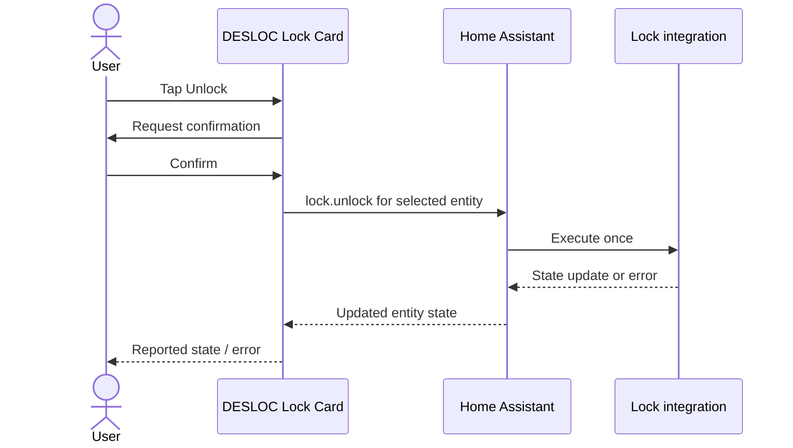

# DESLOC Lock Card

[](https://github.com/ha-homelab/ha-desloc-card/actions/workflows/ci.yml)

A Home Assistant dashboard card for [DESLOC for Home Assistant](https://github.com/ha-homelab/ha-desloc).
Shows reported lock state, battery, and Wi-Fi signal, with lock/unlock controls,
a visual editor, light/dark theme support, and a required unlock confirmation.
The card is independent of DESLOC, Home Assistant, and HACS.

The companion integration automatically discovers all locks returned by the
DESLOC account. C100 Plus is physically tested; other models are admitted with
experimental, unverified compatibility.
The card uses Home Assistant entities and actions; it never receives DESLOC
credentials or connects directly to the vendor cloud. It can also display other
standard HA lock entities, but their behavior depends on the underlying integration.


Cropped actual UI from Home Assistant 2026.9.1 with card 0.1.1. This capture shows
the cloud-reported bolt state, which may be cached; it is not a door-open sensor.
See the [screenshot gallery](docs/screenshots.md) for the visual editor and an
earlier unlocked-state capture.

## Install through HACS

**Not yet published in the default HACS catalog.** Add the repository manually;
the [catalog submission](https://github.com/hacs/default/pull/11473) is pending
review and has not been accepted. The card and integration
are separate repositories: install the [DESLOC integration](https://github.com/ha-homelab/ha-desloc#installation)
first if you do not already have a lock entity.

1. Add `https://github.com/ha-homelab/ha-desloc-card` to HACS **Custom repositories**,
   type **Dashboard** (called **Plugin** in some versions).
2. Download the latest stable release of **DESLOC Lock Card** (not `main` or a
   prerelease) and reload the browser.
3. Edit a dashboard, add **DESLOC Lock Card**, and select the lock and optional
   battery/Wi-Fi sensors in the visual editor.

Home Assistant 2026.9.1 is the tested baseline.

If HACS does not register a resource automatically, add
`/hacsfiles/ha-desloc-card/ha-desloc-card.js` as a **JavaScript module** under
**Settings → Dashboards → ⋮ → Resources**. Enable **Advanced mode** in your
HA profile if the resources menu is hidden.

## Manual installation without HACS

1. Download `ha-desloc-card.js` from the [latest stable release](https://github.com/ha-homelab/ha-desloc-card/releases/latest).
2. Copy it into your HA configuration directory as `www/ha-desloc-card.js`.
   Create `www` if it does not exist. For HA OS, the full path is
   `/config/www/ha-desloc-card.js`. For Container, use the configuration directory
   mounted at `/config`.
3. Under **Settings → Dashboards → ⋮ → Resources**, add
   `/local/ha-desloc-card.js` with type **JavaScript module**. Enable Advanced mode
   in your profile if needed. If you just created `www`, restart HA once.
4. Reload the browser, edit a dashboard, and add **DESLOC Lock Card**. Choose the
   lock entity and optional sensors, or use the YAML below.

To update, replace the JS file with the new stable release and reload the browser.
If it remains cached, append the version to the resource URL, for example
`/local/ha-desloc-card.js?v=0.1.1`. Do not register both the HACS and manual resource
URLs at once.

## Configuration

```yaml
type: custom:desloc-lock-card
entity: lock.front_door
name: Front door
battery_entity: sensor.front_door_battery
signal_entity: sensor.front_door_wi_fi_signal
```

Use your actual entity IDs. Only `entity` is required; it must be a `lock` entity.
`name`, `battery_entity`, and `signal_entity` are optional. Use a battery percentage
sensor and RSSI sensor in dBm. Omit sensors that do not exist.

## Behavior

- Unlock requires a reported **locked** state and an explicit confirmation.
- Commands are disabled while a request or state transition is in progress.
- Unknown state permits an explicit **Lock** action for recovery, but not Unlock.
- Unavailable entities disable both actions. Missing sensor data is displayed as
  unavailable, never as zero.
- The card never retries a command automatically and never invents a successful
  state. A failed or unconfirmed action displays an error.
- The information button opens the normal Home Assistant entity details.

Reported bolt state is not a door-open sensor and may be cached by the cloud.
After an uncertain result, check the physical lock before issuing another command.



## Development

Requires Node.js 24 or newer for the development workflow. The shipped JavaScript
has no runtime dependencies and needs no build step.

```sh
npm ci --ignore-scripts
npm test
```

Tests cover confirmation, duplicate clicks, failure behavior, unavailable states,
safe rendering, and editor configuration. They mock HA; they do not operate a lock.
Before a release, also check the card in Home Assistant on desktop and mobile sizes.

## Contributing and security

Open issues and pull requests in this repository. Include browser/HA versions and
an anonymized card configuration. Never post account sessions, access tokens,
raw network captures, private device identifiers, or Home Assistant backups.
Report vulnerabilities privately using GitHub's security reporting when available.

## License

[MIT](LICENSE). Names and trademarks belong to their respective owners.
