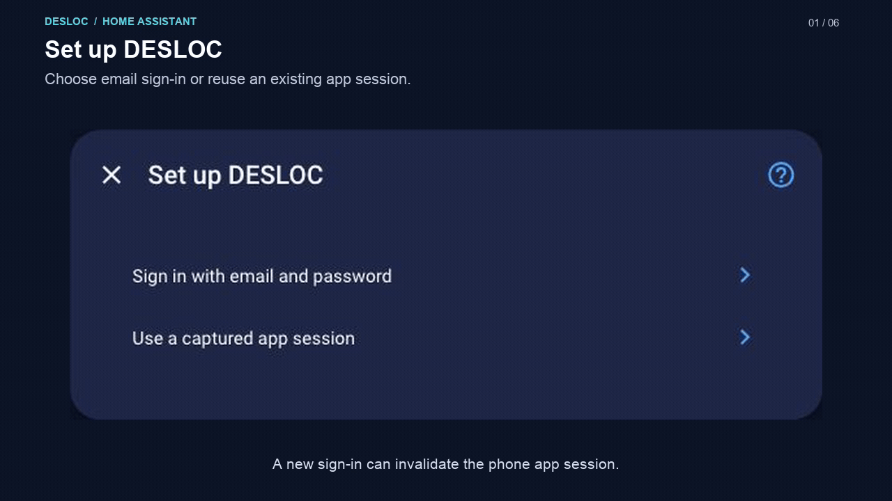
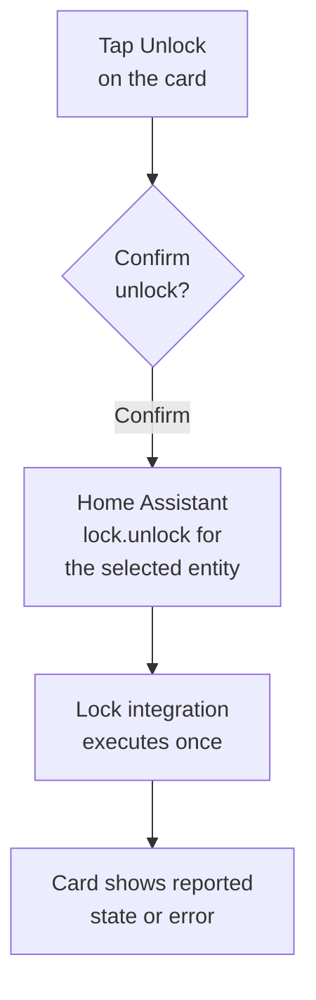

# DESLOC Lock Card

[](https://www.bestpractices.dev/en/projects/15472)

[](https://github.com/ha-homelab/ha-desloc-card/actions/workflows/ci.yml)

[](docs/fuzzing.md)

A Home Assistant dashboard card for [DESLOC for Home Assistant](https://github.com/ha-homelab/ha-desloc).
Shows reported lock state, battery, and Wi-Fi signal, with lock/unlock controls,
a visual editor, light/dark theme support, and a required unlock confirmation.
The card is independent of DESLOC, Home Assistant, and HACS.

The companion integration automatically discovers all locks returned by the
DESLOC account. C100 Plus is maintainer-tested. D110 Plus has a
[general working report](https://github.com/home-assistant/feature-requests/discussions/2138#discussioncomment-18702050)
and a [second report that also confirms PIN functionality](https://github.com/home-assistant/feature-requests/discussions/2138#discussioncomment-18706123),
both from October 1, 2026. The PIN report does not describe its creation workflow,
keypad testing, or firmware version. Other models remain experimental. See the integration's
[compatibility notes](https://github.com/ha-homelab/ha-desloc/blob/main/docs/compatibility.md).
The card uses Home Assistant entities and actions; it never receives DESLOC
credentials or connects directly to the vendor cloud. It can also display other
standard HA lock entities, but their behavior depends on the underlying integration.



A looping 30-second English walkthrough of the companion integration and card,
made from actual UI screenshots in Home Assistant 2026.9.1 with integration 0.3.0
and card 0.1.1. It is not a continuous recording or proof of physical lock
actuation. The cloud-reported bolt state may be cached; it is not a door-open sensor.

[Watch the MP4](docs/media/desloc-overview.mp4), read the
[scene synopsis](docs/screenshots.md#video-overview), or browse the
[static screenshot gallery](docs/screenshots.md).

## Install through HACS

**Not yet published in the default HACS catalog.** Add the repository manually;
the [catalog submission](https://github.com/hacs/default/pull/11473) is pending
review and has not been accepted. The card and integration
are separate repositories: install the [DESLOC integration](https://github.com/ha-homelab/ha-desloc#installation)
first if you do not already have a lock entity.

1. Add `https://github.com/ha-homelab/ha-desloc-card` to HACS **Custom repositories**,
   type **Dashboard** (called **Plugin** in some versions).
2. Download the latest stable release of **DESLOC Lock Card** (not `main` or a
   prerelease) and reload the browser.
3. Edit a dashboard, add **DESLOC Lock Card**, and select the lock and optional
   battery/Wi-Fi sensors in the visual editor.

Home Assistant 2026.9.1 is the tested baseline.

If HACS does not register a resource automatically, add
`/hacsfiles/ha-desloc-card/ha-desloc-card.js` as a **JavaScript module** under
**Settings → Dashboards → ⋮ → Resources**. Enable **Advanced mode** in your
HA profile if the resources menu is hidden.

## Manual installation without HACS

1. Download `ha-desloc-card.js` from the [latest stable release](https://github.com/ha-homelab/ha-desloc-card/releases/latest).
2. Copy it into your HA configuration directory as `www/ha-desloc-card.js`.
   Create `www` if it does not exist. For HA OS, the full path is
   `/config/www/ha-desloc-card.js`. For Container, use the configuration directory
   mounted at `/config`.
3. Under **Settings → Dashboards → ⋮ → Resources**, add
   `/local/ha-desloc-card.js` with type **JavaScript module**. Enable Advanced mode
   in your profile if needed. If you just created `www`, restart HA once.
4. Reload the browser, edit a dashboard, and add **DESLOC Lock Card**. Choose the
   lock entity and optional sensors, or use the YAML below.

To update, replace the JS file with the new stable release and reload the browser.
If it remains cached, append the version to the resource URL, for example
`/local/ha-desloc-card.js?v=0.1.2`. Do not register both the HACS and manual resource
URLs at once.

## Configuration

```yaml
type: custom:desloc-lock-card
entity: lock.front_door
name: Front door
battery_entity: sensor.front_door_battery
signal_entity: sensor.front_door_wi_fi_signal
```

Use your actual entity IDs. Only `entity` is required; it must be a `lock` entity.
`name`, `battery_entity`, `signal_entity`, and `language` are optional. Use a battery percentage
sensor and RSSI sensor in dBm. Omit sensors that do not exist.

## Languages

The card and visual editor support 24 languages and follow your Home Assistant
profile by default. Use **Language** in the editor or an optional `language: fr`
in YAML to choose a different language for one card. Arabic, Hebrew, and Persian
use right-to-left layout. Regional tags resolve to the matching pack; unsupported
languages fall back to English. All translations ship in the single JS file.

Changing language does not send commands or change lock names, entity IDs, or
telemetry. Unlock confirmation and command errors use the selected language.
See the [language guide](docs/i18n.md) for the complete list, fallback rules, and
translation contributions. Documentation and the screenshot walkthrough remain
in English.

## Behavior

- Unlock requires a reported **locked** state and an explicit confirmation that
  names the selected lock. The title and confirmation use the configured display
  name, then the entity's current friendly name, then its entity ID.
- The caption says **Reported lock state** for every entity; it does not infer a
  vendor or cloud connection from the entity ID or name.
- Commands are disabled while a request or state transition is in progress.
- Unknown state permits an explicit **Lock** action for recovery, but not Unlock.
- Unavailable entities disable both actions. Missing sensor data is displayed as
  unavailable, never as zero.
- The card never retries a command automatically and never invents a successful
  state. A failed or unconfirmed action displays an error.
- The information button opens the normal Home Assistant entity details.

Reported bolt state is not a door-open sensor and may be cached by the cloud.
After an uncertain result, check the physical lock before issuing another command.

Cancelling the confirmation closes the prompt without sending a command.


```mermaid
flowchart TD
    tap["Tap Unlock<br/>on the card"] --> confirm{"Confirm<br/>unlock?"}
    confirm -- Confirm --> ha["Home Assistant<br/>lock.unlock for<br/>the selected entity"]
    ha --> integration["Lock integration<br/>executes once"]
    integration --> result["Card shows reported<br/>state or error"]
```

## Development

Requires Node.js 24 or newer for the development workflow. The shipped JavaScript
has no runtime dependencies. Normal installation needs no build step; translation
contributors regenerate the checked-in dictionary with `node scripts/build-i18n.mjs`.

```sh
npm ci --ignore-scripts
npm test
```

Tests cover confirmation, duplicate clicks, failure behavior, unavailable states,
safe rendering, editor configuration, and all 24 language packs. Translation
contract tests also check the generated single-file bundle and placeholders. They mock HA; they do not operate a lock.
Before a release, also check the card in Home Assistant on desktop and mobile sizes.
The [RC fuzzing guide](docs/fuzzing.md) explains the isolated mutation targets,
budgets and diagnostics; [release instructions](RELEASING.md) describe the
versioned HACS assets and review gates.

## Contributing and security

Open issues and pull requests in this repository. Include browser/HA versions and
an anonymized card configuration. Never post account sessions, access tokens,
raw network captures, private device identifiers, or Home Assistant backups.
Report vulnerabilities privately using GitHub's security reporting when available.

## License

[MIT](LICENSE). Names and trademarks belong to their respective owners.

## Project maintenance

See [contribution and test requirements](CONTRIBUTING.md), the
[security reporting policy](SECURITY.md), [security design](docs/security-design.md),
and the [OpenSSF evidence and remaining criteria](docs/openssf-evidence.md).

## Project practices

[Contribute](CONTRIBUTING.md) · [Governance](GOVERNANCE.md) ·
[Code of Conduct](CODE_OF_CONDUCT.md) · [Roadmap](ROADMAP.md) ·
[Quality and assessment scope](docs/quality.md)
