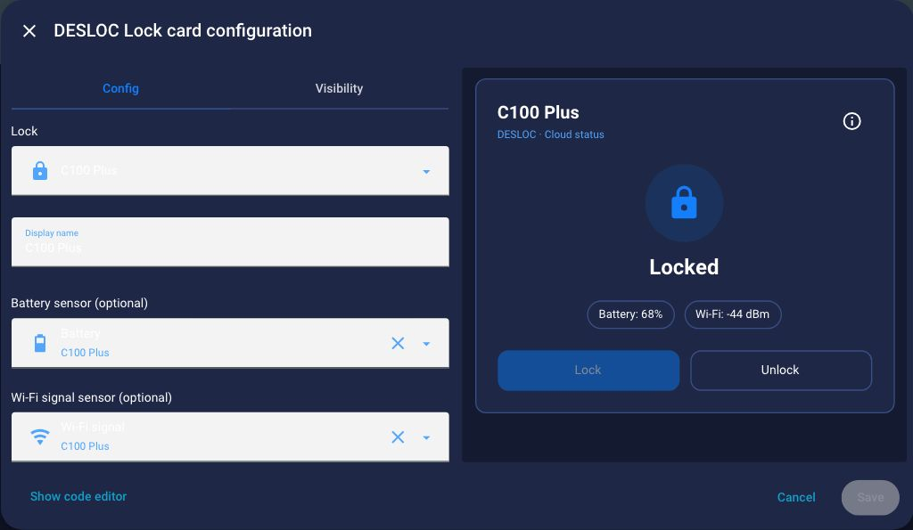
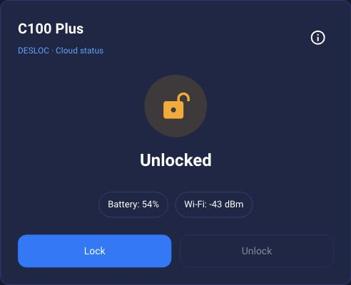

# Screenshots

These are cropped captures of the actual Home Assistant interface. The new
locked-state and visual-editor screenshots use Home Assistant 2026.9.1 and DESLOC
Lock Card 0.1.1. No lock or unlock commands were executed while making these new
captures.

The displayed state comes from the underlying integration. With DESLOC, it is a
cloud-reported bolt state that may be cached, not a door-open sensor. Screenshots
record what the interface displayed at capture time, not the lock's current state.

## Video overview

[Watch the 30-second overview](media/desloc-overview.mp4) of the companion
integration and dashboard card. This silent, English screenshot walkthrough is
1280 × 720 at 30 fps. The actual UI was captured on October 1, 2026, using Home
Assistant 2026.9.1, DESLOC integration 0.3.0, and DESLOC Lock Card 0.1.1. It is an
edited sequence of screenshots, not a continuous recording or evidence of
physical lock actuation.

The README uses a [looping GIF](media/desloc-overview.gif) of the same 30-second
screenshot sequence. The MP4, text synopsis below, and static screenshots remain
available as alternatives to the animation.

The six scenes, in order:

1. **Set up DESLOC:** choose email sign-in or an existing app session. A new
   sign-in can invalidate the phone app session.
2. **Discover locks:** all returned locks are added during setup or
   reconfiguration. C100 Plus is tested; other models are experimental.
3. **View reported state:** the card shows bolt state, battery, and Wi-Fi.
   Cloud reports may be cached and are not a door-open sensor.
4. **Configure the card:** select a lock, display name, and optional sensors.
   The card uses HA entities and never receives DESLOC credentials.
5. **Add a permanent PIN user:** open Settings → Devices & services → DESLOC →
   Configure. The displayed form is empty; submitting it creates permanent access.
6. **Find the projects:** the unofficial cloud integration and optional card
   are separate repositories. C100 Plus is physically tested; other models remain
   experimental.

## Reported locked state

The card displays the reported Locked state and optional battery and Wi-Fi
sensors. Unlock requires confirmation when selected.

## Visual editor

Choose a lock entity, display name, and optional battery and Wi-Fi sensors. The
preview shows the resulting card beside the form.

## Earlier reported unlocked state

This image is preserved from an earlier capture. It illustrates the reported
Unlocked appearance and does not describe the lock's current state.

For installation, use the [README](../README.md). The card's
[HACS catalog submission](https://github.com/hacs/default/pull/11473) is pending;
install it as a custom repository until it is accepted.
